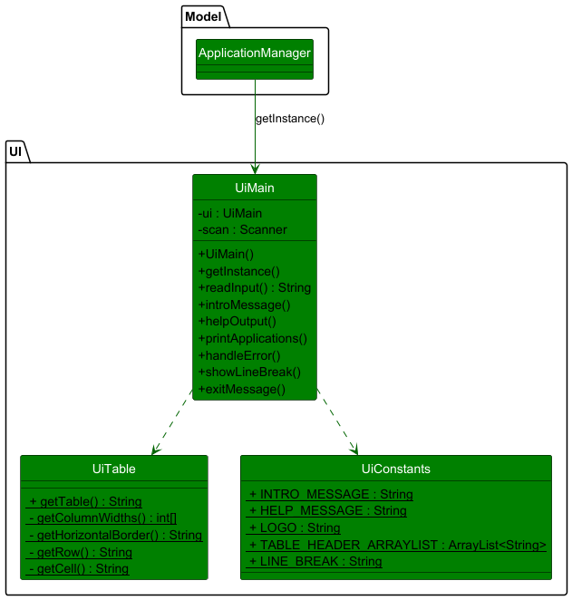
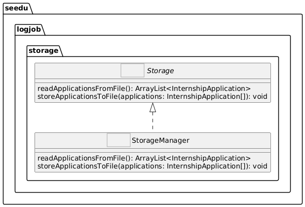
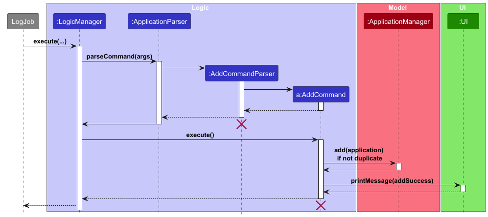

# LogJob Developer Guide

* Table of Contents
* [LogJob Developer Guide](#logjob-developer-guide)
  * [**Acknowledgements**](#Acknowledgements) 
  * [**Setting up, getting started**](#setting-up-getting-started)
  * [**Design**](#design)
    * [Architecture](#architecture)
    * [UI component](#ui-component)
    * [Logic component](#logic-component)
    * [Model component](#model-component)
    * [Storage component](#storage-component)
  * [**Implementation**](#implementation)
    * [Add an internship application](#add-an-internship-application)
    * [Edit an internship application](#edit-an-internship-application)
    * [Delete an internship application](#delete-an-internship-application)
    * [List all internship applications](#list-all-internship-applications)
    * [Sort internship applications by field](#sort-internship-applications-by-field)
    * [Find an internship application](#find-an-internship-application)
    * [Help command](#help-command)
    * [Exit the application](#exit-the-application)
* [**Documentation, logging, testing, configuration, dev-ops**](#documentation-logging-testing-configuration-dev-ops)
  * [**Appendix: Requirements**](#appendix-requirements)
    * [Product scope](#product-scope)
    * [User stories](#user-stories)
    * [Use cases](#use-cases)
    * [Non-Functional Requirements](#non-functional-requirements)
    * [Glossary](#glossary)
  * [**Appendix: Instructions for manual testing**](#appendix-instructions-for-manual-testing)
    * [Launch](#launch)
    * [Adding an internship application](#adding-an-internship-application)
    * [Editing an internship application](#editing-an-internship-application)
    * [Deleting an internship application](#deleting-an-internship-application)
    * [Listing applications](#listing-applications)
    * [Help](#help)
    * [Exit](#exit)
--------------------------------------------------------------------------------------------------------------------

## **Acknowledgements**

* {list here sources of all reused/adapted ideas, code, documentation, and third-party libraries -- include links to the original source as well}

--------------------------------------------------------------------------------------------------------------------

## **Setting up, getting started**

Refer to the guide [_Setting up and getting started_](SettingUp.md).

--------------------------------------------------------------------------------------------------------------------

## **Design**

:bulb: **Tip:** The `.puml` files used to create diagrams in this document `docs/diagrams` folder. Refer to the [_PlantUML Tutorial_ at se-edu/guides](https://se-education.org/guides/tutorials/plantUml.html) to learn how to create and edit diagrams.

### Architecture

The ***Architecture Diagram*** given above explains the high-level design of the App.
Given below is a quick overview of main components and how they interact with each other.

**Main components of the architecture**

**`Main`** (consisting of [`LogJob`](https://github.com/se-edu/addressbook-level3/tree/master/src/main/java/seedu/address/Main.java) class) is in charge of the app launch and shut down.
* At app launch, it initializes the other components in the correct sequence, and connects them up with each other.
* At shut down, it shuts down the other components and invokes cleanup methods where necessary.

The bulk of the app's work is done by the following four components:

* [**`UI`**](#ui-component): The UI of the App.
* [**`Logic`**](#logic-component): The command parser/executor.
* [**`Model`**](#model-component): Holds the data of the App in memory.
* [**`Storage`**](#storage-component): Reads data from, and writes data to, the hard disk.

**How the architecture components interact with each other**

The *Sequence Diagram* below shows how the components interact with each other for the scenario where the user issues the command `delete 1`.

For the two main components [`Model`](...) and [`Storage`](...) dealing with application state,

* defines its *API* in an `interface` with the same name as the Component.
* implements its functionality using a concrete `{Component Name}Manager` class (which follows the corresponding API `interface` mentioned in the previous point.

For example, the [`Storage`](...) component defines its API in the [`Storage.java`](...) interface. It implements this interface via the [`StorageManager.java`](...) class. Other components interact through this interface rather than a concrete calss to prevent other components being coupled to the implementation. 

The sections below give more details of each component.

### UI component

The **API** of this component is specified in [`UiMain.java`](https://github.com/AY2425S2-CS2113-T11a-2/tp/blob/master/src/main/java/seedu/logjob/ui/UiMain.java)

The UI consists of a `UiMain` that handles the direct interactions between the user and the program logic.

The `UI` component is called by the ApplicationManager,
* Receive command from the user on the CLI.
* Outputs the list of applications on the CLI.
* Outputs the responses of the program to the user.
* Outputs the error message that is thrown by the program.

The Class UiMain is a Singleton that only the ApplicationManager gets an Instance of the class.

The UiMain also calls the methods in the Utility class UiTable to generate the table for the list of application.
The getTable() method will return the full string of the application table to the UiMain.

The UiMain also access constants specified in the UiConstants class.

### Logic component

**API** : [`Logic.java`]

Here's a (partial) class diagram of the `Logic` component:

How the `Logic` component works:

1. When `Logic` is called upon to execute a command, it is passed to an `ApplicationParser` object which in turn creates a parser that matches the command (e.g., `DeleteCommandParser`) and uses it to parse the command.
1. This results in a `Command` object (more precisely, an object of one of its subclasses e.g., `DeleteCommand`) which is executed by the main program.
1. The command can communicate with the `Model` when it is executed (e.g. to delete a person). 
   Note that although this is shown as a single step in the diagram above (for simplicity), in the code it can take several interactions (between the command object and the `Model`) to achieve.

Here are the other classes in `Logic` (omitted from the class diagram above) that are used for parsing a user command:

How the parsing works:
* When called upon to parse a user command, the `ApplicationParser` class creates an `XYZCommandParser` (`XYZ` is a placeholder for the specific command name e.g., `AddCommandParser`) which uses the other classes shown above to parse the user command and create a `XYZCommand` object (e.g., `AddCommand`) which the `AddressBookParser` returns back as a `Command` object.
* All `XYZCommandParser` classes (e.g., `AddCommandParser`, `DeleteCommandParser`, ...) inherit from the `Parser` interface so that they can be treated similarly where possible e.g, during testing.
* The `ParserUtils` class depends on the `Validator` package to validate each specific field. This ensures user inputs for job title, company name, application status, etc. meet domain constraints before conversion.  

### Model component
**API** : [`Model.java`](https://github.com/se-edu/addressbook-level3/tree/master/src/main/java/seedu/address/model/Model.java)

The `Model` component

* Is in charge of storing the working copy of the current Internship Applications in an ArrayList.
- Implements the `InternshipApplication` class which stores relevant data of an application such as its Company Name, Job Title, Status, and Date.
  - Status is implemented using an enumeration `ApplicationStatus` which helps restrict statuses to a few valid values.
* Handles the actual manipulation of data through the `Application Manager` class.
** It recieves the appropriate command and data from the command classes, and executes the relevant methods. 
* Does not depend on any of the other structures of the program, as it's designed to be a black box to manipulate, store and handle data.

### Storage component

**API** : [`Storage.java`](https://github.com/se-edu/addressbook-level3/tree/master/src/main/java/seedu/address/storage/Storage.java)

Here is a draft of Storage Component

The `Storage` component,
* can save both address book data and user preference data in JSON format, and read them back into corresponding objects.
* inherits from both `AddressBookStorage` and `UserPrefStorage`, which means it can be treated as either one (if only the functionality of only one is needed).
* depends on some classes in the `Model` component (because the `Storage` component's job is to save/retrieve objects that belong to the `Model`)

--------------------------------------------------------------------------------------------------------------------

## **Implementation**

This section describes some noteworthy details on how certain features are implemented.

### Add an internship application

The `AddCommand` handles the creation of new internship applications from user input. The input string is first passed to `ApplicationParser`, which delegates parsing to `AddCommandParser`. This parser extracts the required fields—such as company name, role, status and date—and validates them. If validation succeeds, it passes these fields to `AddCommand` which constructs an `InternshipApplication` with the values.

### Edit an internship application

### Delete an internship application

### List all internship applications

After the input is read and parsed by the parser, the main program calls execute which will then be identified to call the listApplication() method.
The listApplication method calls the printApplications() of the UiMain class, passing in the list of application. UI will do the job of printing the table of applications onto the CLI.

### Sort internship applications by field
### Find an internship application
Here is a drafted sequence diagram of the find command and its execution.

### Help command
### Exit the application

#### Design considerations:

**Aspect: How undo & redo executes:**

* **Alternative 1 (current choice):** Saves the entire address book.
  * Pros: Easy to implement.
  * Cons: May have performance issues in terms of memory usage.

* **Alternative 2:** Individual command knows how to undo/redo by
  itself.
  * Pros: Will use less memory (e.g. for `delete`, just save the person being deleted).
  * Cons: We must ensure that the implementation of each individual command are correct.

_{more aspects and alternatives to be added}_

### \[Proposed\] Data archiving

_{Explain here how the data archiving feature will be implemented}_

--------------------------------------------------------------------------------------------------------------------

## **Documentation, logging, testing, configuration, dev-ops**

* [Documentation guide](Documentation.md)
* [Testing guide](Testing.md)
* [Logging guide](Logging.md)
* [Configuration guide](Configuration.md)
* [DevOps guide](DevOps.md)

--------------------------------------------------------------------------------------------------------------------

## **Appendix: Requirements**

### Product scope

**Target user profile**:

* has a need to manage a significant number of contacts
* prefer desktop apps over other types
* can type fast
* prefers typing to mouse interactions
* is reasonably comfortable using CLI apps

**Value proposition**: manage contacts faster than a typical mouse/GUI driven app

### User stories

Priorities: High (must have) - `* * *`, Medium (nice to have) - `* *`, Low (unlikely to have) - `*`

| Priority | As a …​                                    | I want to …​                     | So that I can…​                                                        |
| -------- | ------------------------------------------ | ------------------------------ | ---------------------------------------------------------------------- |
| `* * *`  | new user                                   | see usage instructions         | refer to instructions when I forget how to use the App                 |
| `* * *`  | user                                       | add a new person               |                                                                        |
| `* * *`  | user                                       | delete a person                | remove entries that I no longer need                                   |
| `* * *`  | user                                       | find a person by name          | locate details of persons without having to go through the entire list |
| `* *`    | user                                       | hide private contact details   | minimize chance of someone else seeing them by accident                |
| `*`      | user with many persons in the address book | sort persons by name           | locate a person easily                                                 |

*{More to be added}*

### Use cases

(For all use cases below, the **System** is the `AddressBook` and the **Actor** is the `user`, unless specified otherwise)

**Use case: Delete a person**

**MSS**

1.  User requests to list persons
2.  AddressBook shows a list of persons
3.  User requests to delete a specific person in the list
4.  AddressBook deletes the person

    Use case ends.

**Extensions**

* 2a. The list is empty.

  Use case ends.

* 3a. The given index is invalid.

    * 3a1. AddressBook shows an error message.

      Use case resumes at step 2.

*{More to be added}*

### Non-Functional Requirements

1.  Should work on any _mainstream OS_ as long as it has Java `17` or above installed.
2.  Should be able to hold up to 1000 persons without a noticeable sluggishness in performance for typical usage.
3.  A user with above average typing speed for regular English text (i.e. not code, not system admin commands) should be able to accomplish most of the tasks faster using commands than using the mouse.

*{More to be added}*

### Glossary

* **Mainstream OS**: Windows, Linux, Unix, MacOS
* **Private contact detail**: A contact detail that is not meant to be shared with others

--------------------------------------------------------------------------------------------------------------------

## **Appendix: Instructions for manual testing**

Given below are instructions to test the app manually.

:information_source: **Note:** These instructions only provide a starting point for testers to work on;
testers are expected to do more *exploratory* testing.

### Launch

1. Initial launch

   1. Download the jar file and copy into an empty folder

   1. Double-click the jar file Expected: Shows the GUI with a set of sample contacts. The window size may not be optimum.

1. Saving window preferences

   1. Resize the window to an optimum size. Move the window to a different location. Close the window.

   1. Re-launch the app by double-clicking the jar file. 
       Expected: The most recent window size and location is retained.

1. _{ more test cases …​ }_

### Getting Help
1. Instructions on how to get help on commands

### Adding an internship application
1. Instructions for adding an internship application

### Editing an internship application
1. Instructions for editing an internship application

### Listing applications
1. Instructions for listing all applications

### Deleting an internship application

1. Deleting a person while all persons are being shown

   1. Prerequisites: List all persons using the `list` command. Multiple persons in the list.

   1. Test case: `delete 1` 
      Expected: First contact is deleted from the list. Details of the deleted contact shown in the status message. Timestamp in the status bar is updated.

   1. Test case: `delete 0` 
      Expected: No person is deleted. Error details shown in the status message. Status bar remains the same.

   1. Other incorrect delete commands to try: `delete`, `delete x`, `...` (where x is larger than the list size) 
      Expected: Similar to previous.

1. _{ more test cases …​ }_

### Saving data

1. Dealing with missing/corrupted data files

   1. _{explain how to simulate a missing/corrupted file, and the expected behavior}_

1. _{ more test cases …​ }_

### Exit
1. Exiting the application
