# LogJob Developer Guide

* Table of Contents
* [LogJob Developer Guide](#logjob-developer-guide)
  * [**Acknowledgements**](#Acknowledgements) 
  * [**Setting up, getting started**](#setting-up-getting-started)
  * [**Design**](#design)
    * [Architecture](#architecture)
    * [UI component](#ui-component)
    * [Logic component](#logic-component)
    * [Model component](#model-component)
    * [Storage component](#storage-component)
  * [**Implementation**](#implementation)
    * [Add an internship application](#add-an-internship-application)
    * [Edit an internship application](#edit-an-internship-application)
    * [Delete an internship application](#delete-an-internship-application)
    * [List all internship applications](#list-all-internship-applications)
    * [Sort internship applications by field](#sort-internship-applications-by-field)
    * [Find an internship application](#find-an-internship-application)
    * [Help command](#help-command)
    * [Exit the application](#exit-the-application)
* [**Documentation, logging, testing, configuration, dev-ops**](#documentation-logging-testing-configuration-dev-ops)
  * [**Appendix: Requirements**](#appendix-requirements)
    * [Product scope](#product-scope)
    * [User stories](#user-stories)
    * [Use cases](#use-cases)
    * [Non-Functional Requirements](#non-functional-requirements)
    * [Glossary](#glossary)
  * [**Appendix: Instructions for manual testing**](#appendix-instructions-for-manual-testing)
    * [Launch](#launch)
    * [Getting Help](#getting-help)
    * [Adding an internship application](#adding-an-internship-application)
    * [Editing an internship application](#editing-an-internship-application)
    * [Deleting an internship application](#deleting-an-internship-application)
    * [Listing applications](#listing-applications)
    * [Exit](#exit)
--------------------------------------------------------------------------------------------------------------------

## **Acknowledgements**

- This Developer Guide structure draws inspiration from [AB-3](https://se-education.org/addressbook-level3/DeveloperGuide.html)
- It uses JUnit5 for testing software

--------------------------------------------------------------------------------------------------------------------

## **Setting up, getting started**

Refer to the guide [_Setting up and getting started_](SettingUp.md).

--------------------------------------------------------------------------------------------------------------------

## **Design**

> 💡 **_NOTE:_** The `.puml` files used to create diagrams in this document `docs/diagrams` folder. Refer to the [_PlantUML Tutorial_ at se-edu/guides](https://se-education.org/guides/tutorials/plantUml.html) to learn how to create and edit diagrams.

### Architecture

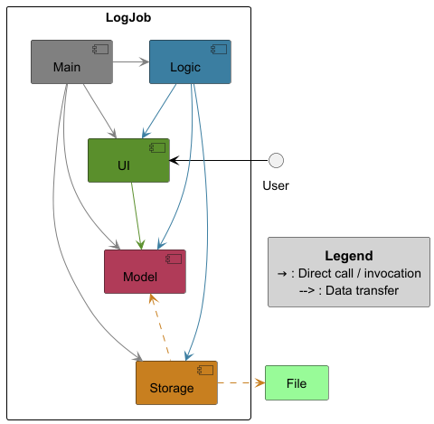

The ***Architecture Diagram*** given above shows the overall architecture of the LogJob application software. A quick overview of each of the components has been given below.

**Main components of the architecture**

**`Main`** (consisting of [`LogJob`](https://github.com/se-edu/addressbook-level3/tree/master/src/main/java/seedu/address/Main.java) class) is in charge of the app launch and shut down.
* At app launch, it initializes the other components in the correct sequence, and connects them up with each other.
* At shut down, it shuts down the other components and invokes cleanup methods where necessary.

The bulk of the app's work is done by the following four components:

* [**`UI`**](#ui-component): The UI of LogJob. Responsible for all user interactions between the user and the application.
* [**`Logic`**](#logic-component): The command parser/executor. Parses, validates, and executes the given command.
* [**`Model`**](#model-component): Holds the data of the App in memory.
* [**`Storage`**](#storage-component): Reads data from, and writes data to, the hard disk.

`Util`: Provides classes for use across multiple other components.

**How the architecture components interact with each other**

The *Sequence Diagram* below shows how the components interact with each other for the scenario where the user issues the command `delete 1`.

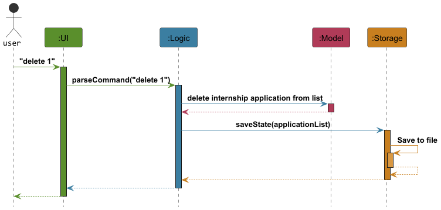

> **NOTE**: The sequence diagram above shows a simplified version of the `delete` command execution for clarity purposes

For the two main components [`Model`](...) and [`Storage`](...) dealing with application state,

* The main components `Logic`, `Model` and `Storage` are defined in interfaces. This allows the implemenetation details of each component to be decoupled from the implementation details.
* The main componetents `Logic`, `Model` and `Storage` are implemented in `LogicManager`, `ApplictationManager`, and `StorageManager` respectively.

> **EXAMPLE:** The [`Storage`](...) component defines its API in the [`Storage.java`](...) interface. It implements this interface via the [`StorageManager.java`](...) class. Other components interact through this interface rather than a concrete calss to prevent other components being coupled to the implementation. 

The sections below give more details of each component.

### UI component

The **API** of this component is specified in [`UiMain.java`](https://github.com/AY2425S2-CS2113-T11a-2/tp/blob/master/src/main/java/seedu/logjob/ui/UiMain.java)

Here is a class diagram of the UI component, not all methods and attributes are included to reduce the complexity.
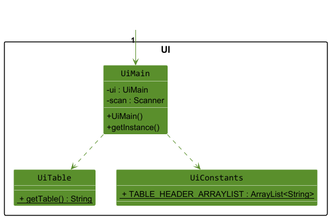

The UI consists of a `UiMain` that handles the direct interactions between the user and the program logic.

The `UI` component is called by the ApplicationManager,
* Receive command from the user on the CLI.
* Outputs the list of applications on the CLI.
* Outputs the responses of the program to the user.
* Outputs the error message that is thrown by the program.

The Class UiMain is a Singleton class, and only one instance exists system wide. It is passed to the necessary components as an instance when needed.

The UiMain also calls the methods in the utility class UiTable to generate the table for the list of application.
The getTable() method will return the full string of the application table to the UiMain.

The UiMain also access constants specified in the UiConstants class.

### Logic component

**API** : [`Logic.java`]

Here's a (partial) class diagram of the `Logic` component (Note that individual parser classes are omitted for clarity and represented by the overall `Parser`package):

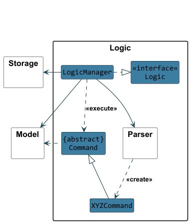

How the `Logic` component works:

1. When `Logic` is called upon to execute a command, it is passed to an `ApplicationParser` object which in turn creates a parser that matches the command (e.g., `DeleteCommandParser`) and uses it to parse the command.
1. This results in a `Command` object (more precisely, an object of one of its subclasses e.g., `DeleteCommand`) which is executed by the `LogicManager`
1. The command can communicate with the `Model` when it is executed (e.g. to delete a person). 
   Note that although this is shown as a single step in the diagram above (for simplicity), in the code it can take several interactions (between the command object and the `Model`) to achieve.
1. After each execution, the `LogicManager` saves the `Model` state by executing `Storage` methods

Here are the other classes in `Parser` (omitted from the class diagram above) that are used for parsing a user command:

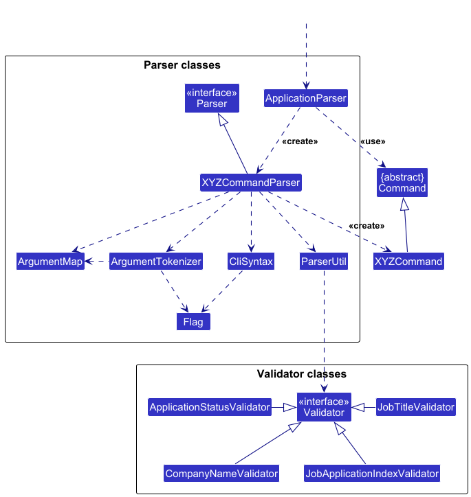

How the parsing works:
* When called upon to parse a user command, the `ApplicationParser` class creates an `XYZCommandParser` (`XYZ` is a placeholder for the specific command name e.g., `AddCommandParser`) 
* `XYZCommandParser` uses the other classes shown above to parse the user command and create a `XYZCommand` object (e.g., `AddCommand`) which is returned back as a `Command` object.
* All `XYZCommand` objects inherit from the abstract `Command` class that defines common methods such as `execute`, `equals`, and `isRunning`.
* All `XYZCommandParser` classes (e.g., `AddCommandParser`, `DeleteCommandParser`, ...) implement the `Parser` interface so that they can be treated similarly where possible e.g, during testing.
* The `ParserUtils` class depends on the `Validator` package to validate each specific field. This ensures user inputs for job title, company name, application status, etc. meet domain constraints before conversion.  

### Model component
**API** : [`Model.java`](https://github.com/se-edu/addressbook-level3/tree/master/src/main/java/seedu/address/model/Model.java)

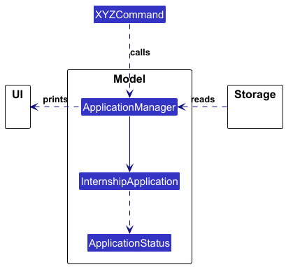

The `Model` component

* Is in charge of storing the working copy of the current Internship Applications in an ArrayList.
- Implements the `InternshipApplication` class which stores relevant data of an application such as its Company Name, Job Title, Status, and Date.
  - Status is implemented using an enumeration `ApplicationStatus` which helps restrict statuses to a few valid values.
* Handles the actual manipulation of data through the `Application Manager` class.
** It recieves the appropriate command and data from the command classes, and executes the relevant methods. 
* Does not depend on any of the other structures of the program, as it's designed to be a black box to manipulate, store and handle data.

### Storage component

**API** : [`Storage.java`](https://github.com/AY2425S2-CS2113-T11a-2/tp/blob/master/src/main/java/seedu/logjob/storage/Storage.java)

Here is a draft of Storage Component
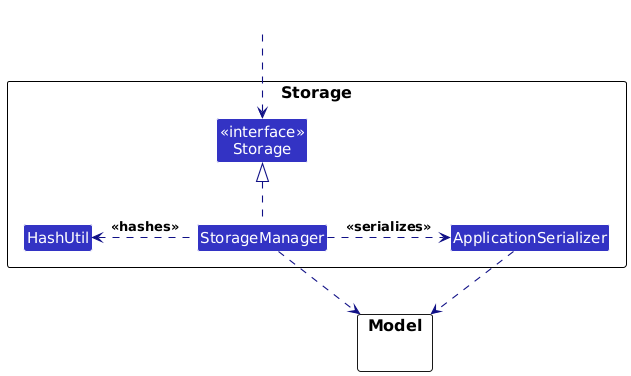

The `Storage` component,
* Is implemented by the StorageManager, which reads and writes from the `data.txt` file stored in disk
* depends on some classes in the `Model` component (because the `Storage` component's job is to save/retrieve objects that belong to the `Model`)
* It depends on `HashUtil` to generate and verify hashes
* It depends on `ApplicationSerializer` to serialize and deserialize applications into a string format.

--------------------------------------------------------------------------------------------------------------------

## **Implementation**

This section describes some noteworthy details on how certain features are implemented.
> ❗ **_NOTE:_** The lifeline for the obejcts instantiated should end at the destroy marker (X) but due to the limitation of PlantUML, the lifeline reaches the end of diagram.

### Add an new internship application
The implementation of the 

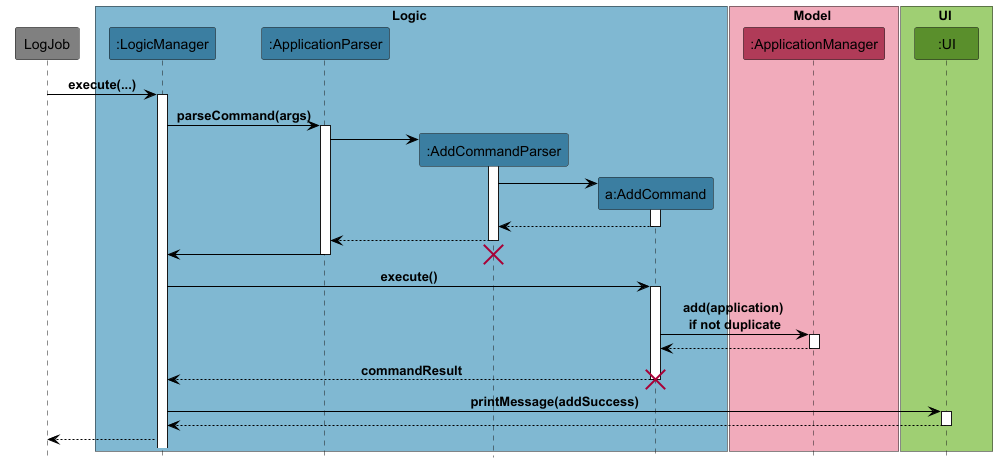

The `AddCommand` handles the creation of new internship applications from user input. The input string is first passed to `ApplicationParser`, which delegates parsing to `AddCommandParser`. This parser extracts the required fields—such as company name, role, status and date—and validates them. If validation succeeds, it passes these fields to `AddCommand` which constructs an `InternshipApplication` with the values.

### Edit an internship application
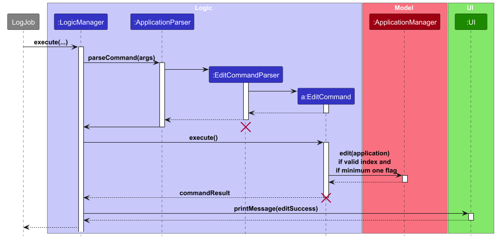
### Delete an internship application
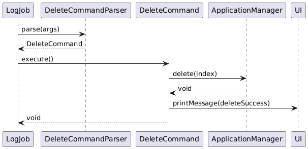
### List all internship applications

After the input is read and parsed by the parser, the main program calls execute which will then be identified to call the listApplication() method.
The listApplication method calls the printApplications() of the UiMain class, passing in the list of application. UI will do the job of printing the table of applications onto the CLI.

### Sort internship applications by field
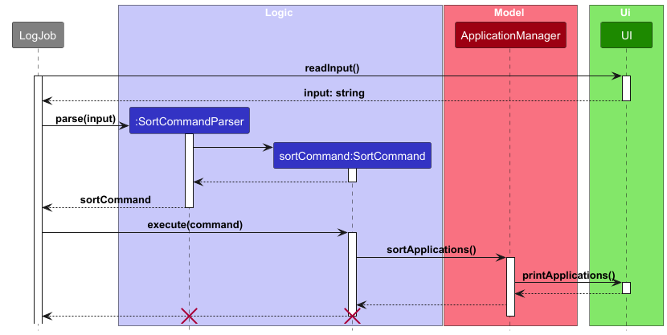

Very similar to the list command, sort command reads and parses the input from the user and execute the sorting on the application list 
and finally automatically calls a printApplications() to print the table of applications (now sorted) onto the CLI.

### Find an internship application

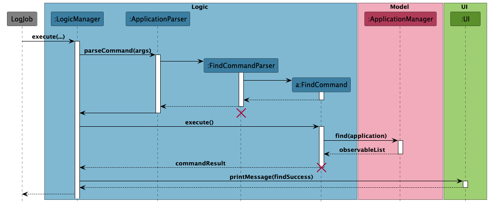

### Help command

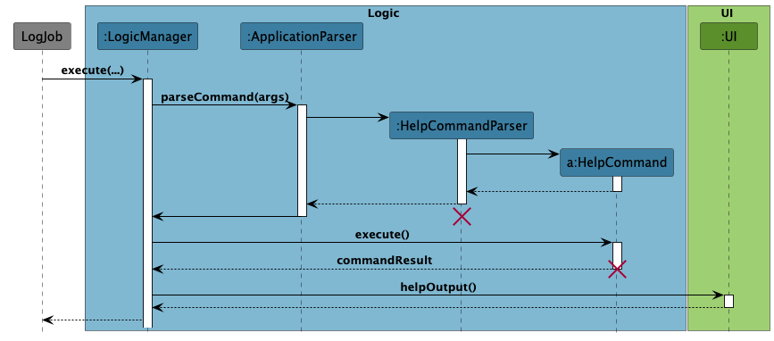

### Exit the application
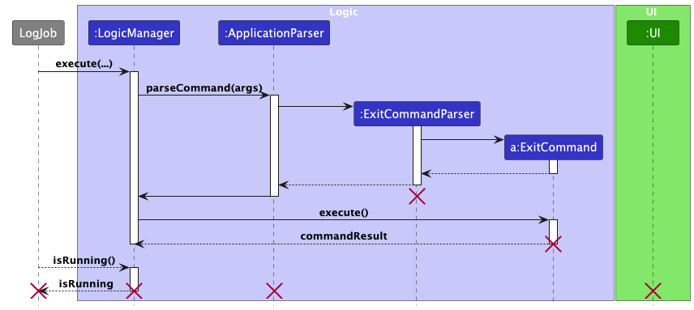

--------------------------------------------------------------------------------------------------------------------

## **Design considerations:**
1. **Clear Seperation of Concerns:** When deciding the architecture, we wanted to ensure that the different components of the application are clearly separated. This allows for easier maintenance and development of the application as the team could work on different components simultaneously. For example, the `Logic` component is responsible for parsing and executing commands, while the `Model` component is responsible for managing the data.
2. **Intuitive User Experience:** To make the application user-friendly, we tried to make the commands as intuitive as possible, and even developed a help command to assist users in understanding how to use the application. The commands are designed to be similar to common CLI commands, making it easier for users who are familiar with command line interfaces.
3. **Extensibility:** The architecture is designed to be extensible, allowing for future features to be added without significant changes to the existing codebase. For example, the `Logic` component can easily accommodate new commands by adding new command classes and parsers.

### \[Proposed\] Data archiving

Our code is set up so that data persistence is handled by our Storage component. The plan for data archiving is to integrate an extension of this component that allows older data to be serialized and moved into a separate archive file. Essentially, when the application manager updates or cleans up the current data store, the archiving feature would trigger the StorageManager to back up the relevant data (for example, in JSON format) and move it to an archive file. This modular approach ensures that data archiving is added without major changes to the existing persistence logic.

--------------------------------------------------------------------------------------------------------------------

## **Appendix: Requirements**

### Product scope

**Target user profile**:

* has a need to manage a significant number of internship applications
* can type fast
* prefers typing to mouse interactions
* is reasonably comfortable using CLI apps

**Value proposition**: manage internship applications faster than a typical mouse/GUI driven app

### User stories

Priorities: High (must have) - `* * *`, Medium (nice to have) - `* *`, Low (unlikely to have) - `*`

| Priority | As a …​    | I want to …​                                                                                                | So that I can…​              |
| -------- |------------|-------------------------------------------------------------------------------------------------------------|------------------------------|
| `* * *`  | Job Seeker | Keep track of all the applications I made                                                                   | Easily view their statuses in one place |
| `* * *`  | Job Seeker | Add new job applications to a list with data such as company name, job title, applied date and application status | Track my application history |
| `* * *`  | Job Seeker | Delete applications if deemed redundant                                                                     | Keep my current applications list clean |
| `* * *`  | Job Seeker | Have persistence throughout different sessions                                                              | Work on my applications over time|
| `* *`    | Job Seeker | Sort a list                                                                                                 | See my application list by name or application date |
| `*`      | Job Seeker | Find applications by their name or job type                                                                 | Quickly filter a list from my application pool |

### Use cases

(For all use cases below, the **System** is `LogJob` and the **Actor** is the `User`, unless specified otherwise)

**Use case: Delete a person**

**MSS**

1.  User adds internship applicaions to the application list
2.  LogJob adds the internship applications to the list
3. User requests to view the list of applications
4. LogJob shows the list of applications
5. User requests to delete a specific application in the list
6. LogJob deletes the application from the list
7. User wants to edit a specific application in the list
8. Logjob updates the application in the list
9. Use case ends.

### Non-Functional Requirements

1.  Should work on any _mainstream OS_ as long as it has Java `17` or above installed.
2.  Should be able to hold up to 1000 applications without a noticeable sluggishness in performance for typical usage.
3.  A user with above average typing speed for regular English text (i.e. not code, not system admin commands) should be able to accomplish most of the tasks faster using commands than using the mouse.

### Glossary

* **Mainstream OS**: Windows, Linux, Unix, MacOS

--------------------------------------------------------------------------------------------------------------------

## **Appendix: Instructions for manual testing**

Given below are instructions to test the app manually.

### Launch

1. Initial launch
   1. Download the jar file and copy into an empty folder
   2. Open the terminal and navigate to the folder.
   3. Type `java -jar LogJob.jar` and press enter.
   4. Adjust the terminal size as necessary to prevent the text from wrapping.
   5. Test the commands below to ensure the application is working as expected.

### Getting Help
1. Input: `help` 
2. Expected: Shows a table of commands and their usage

### Adding an internship application
1. Input: `add -n Goggle -j SWE -s APPLIED -d 2025-01-01` 
   Expected: `Application: Goggle SWE APPLIED Added Successfully`

### Editing an internship application
1. Input: `edit 1 -n Goggle -j HWE -s INTERVIEW -d 2025-02-02` 
2. Expected: `Application: Goggle HWE INTERVIEW Edited Successfully`

### Listing applications
1. Input: `list`
2. Expected: Table with all current internship applications. 
   - The table should be formatted with the following columns:
     - Index
     - Company Name
     - Job Title
     - Application Status
     - Date of Application

### Sort the internship applications
1. Input: `sort -n/-d` 
2. Expected: Use `list` command to ensure that the list is sorted by  
    - `-n` : Company Name
    - `-d` : Date of Application

### Find an internship application
1. Input: `find <keyword>` 
2. Expected: Applications that contain the keyword in their company name, job title, status or date are displayed. 

### Deleting an internship application
1. Input: `delete 1` 
2. Expected: `Index: 1 Successful Deletion` 

### Exit
1. Input: `exit` 
2. Expected: The application closes 

### Data Persistence
1. Input: Exit the program and restart the program.  
2. Expected: The data from the previous session is retained. Use `list` command to verify.
