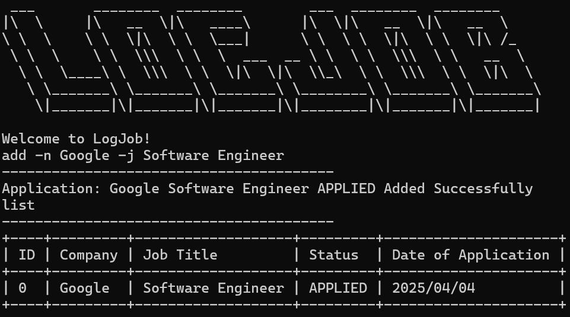
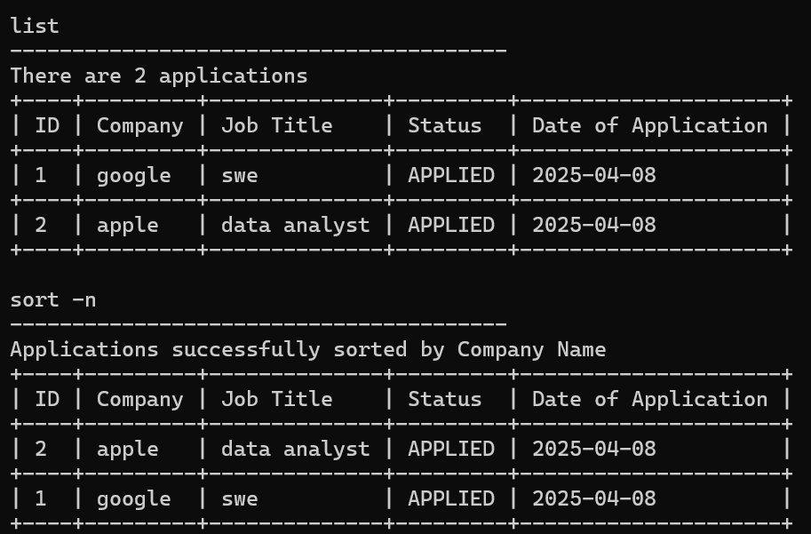
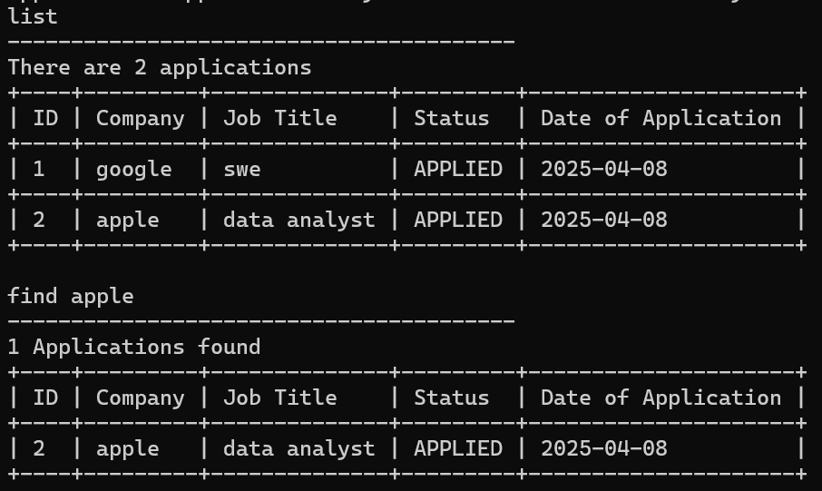
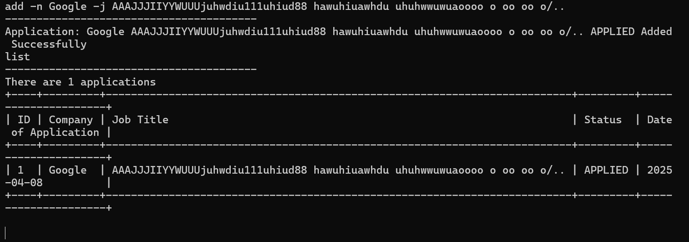

# User Guide

## Introduction

LogJob (LJ) is a desktop app for managing job applications, optimized for use via a Command Line Interface (CLI). If you can type fast, LJ can get your job application management tasks done faster than traditional GUI apps.

# Table of Contents

- [Quick Start](#quick-start)
- [Features](#features)
    - [Adding an application: add](#adding-an-application-add)
    - [Editing an application: edit](#editing-an-application-edit)
    - [Listing the application: list](#listing-the-application-list)
    - [Sort the application: sort](#sort-the-application-sort)
    - [Delete an application: delete](#delete-an-application-delete)
    - [Find an application by keyword: find](#find-an-application-by-keyword)
    - [Getting help](#getting-help)
    - [Exit from the application](#exit-from-the-application)
- [Known Issues](#known-issues)
- [FAQ](#faq)
- [Command Summary](#command-summary)

---
## Quick Start

1. Ensure that you have Java 17 or above installed.
2. Down the latest version of `LogJob.jar` from [here](https://github.com/AY2425S2-CS2113-T11a-2/tp/releases).
3. Open a command terminal, `cd` into the folder you put the jar file in, and use the `java -jar LogJob.jar` command to run the application. A greeting message similar to the below should appear. 
4. Type the command in the command box and press Enter to execute it. e.g. typing **`help`** and pressing Enter will open the help window. 
   Some example commands you can try: 
   `add -n Google -j Software Engineer` 
    `list`
5. For more possible commands please refer to the Features and the Command Summary sections.
---
## Features

### Adding an application: `add`
Adds a new Internship Application into the list

Format `add -n [COMPANY NAME] -j [JOB TITLE] -s [APPLICATION STATUS] -d[DATE]`

Example of usage:
`add -n Goggle -j SWE -s INTERVIEW -d 2025-01-01`

**📌Note** that `-s` and `-d` flags are optional, if blank, will default to `APPLIED` and `Today's date` 

Both **Company Name** (`-n`) and **Job Title** (`-j`) must:
- Be **non-empty**
- Contain only **alphanumeric characters** and **allowed special symbols**:  
  `& , - . ' / ( ) ~ ! @ # $ % ^ * _ + = ?`
- Be at most **50 characters long**

❗ Input exceeding this limit or using unsupported characters will result in an error.

💡 Examples of valid names:
- `JP Morgan & Chase`
- `SWE (Intern)`
- `R&D / Data Analyst - AI`

Here is a list of possible status accepted by the application:
> applied 
> interview 
> rejected 
> offered 
> accepted 
> rejected_offer 

💡 The status is case-insensitive.

❗To include the date of application, follow the format: `YYYY-MM-DD` as shown in the example.

### Editing an application: `edit`
Edits an existing Internship Application on the list at position INDEX

Format `edit INDEX [-n COMPANY NAME] [-j JOB TITLE] [-s APPLICATION STATUS] [-d DATE]`

Example of usage:
`edit 0 -s OFFERED -d 2025-04-01`

**📌Note** that INDEX has to be an integer from `0` to `n-1`, where `n`  is the total number of applications.
Edit must also contain at least one flag.

### Listing the application: `list`
List the job applications to the command line interface.

Format: `list`

* no other argument is expected

Example of usage:

`list`

### Sort the application: `sort`
Sort the job applications and output the sorted list onto the command line interface.

Format: `sort -n/-d`

* `-d` Sort the list based on the date of application
* `-n` Sort the list based on the name of company

Example of usage:

`sort -n`

`sort -d`

💡 Sorting by name of company is case-insensitive.

Expected Output: 

### Delete an application: `delete`
Delete applications by index.
 * No flags taken
 * Index is provided as preamble (as shown below)

Example of usage:

`delete 0`

`delete 3`

### Find an application by keyword
Finds applications with the given keyword as a substring.

* No flags given
* Non-empty preamble required with search term (shown below)

Example of usage:

`find engineer`

`find applied`

Expected Output:

### Getting help
Get help on command syntax. Prints a help message onto the terminal.

* No flags given
* No preamble given

Example usage:

`help`

### Exit from the application
Exits from LogJob.

* No flags given
* No preamble given

Example usage:

`exit`

## FAQ

**Q**: How do I transfer my data to another computer? 

**A**: You can simply move over data.txt to the same directory as LogJob.jar anywhere, and LogJob will be synchronised!

**Q**: How do I save my data?

**A**: No need to manually save your data! LogJob will automatically save your data to your computer whenever you exit the application.

## Known Issues

1. When the terminal window is not large enough to display the whole row of application, the row will be wrapped around by the terminal, this is due to the limitation of Command Line Interface. 

Try to enlarge or full screen the terminal when encountering such issue, refrain from adding company names or job titles that are too long.

## Command Summary

{Give a 'cheat sheet' of commands here}

* Add application `add -n [COMPANY NAME] -j [JOB TITLE] -s [APPLICATION STATUS] -d[DATE]`
* List applications `list`
* Sort applications `sort -n/-d`
* Delete applications `delete <index>`
* Find applications `find <keyword>`
